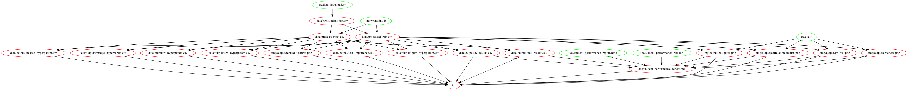

# DSCI522 Group 403 - Student Performance Predictors

Investigating the predictors of Portuguese high school student
performance

This project is proudly brought to you by:

  - [Brayden Tang](https://github.com/braydentang1)
  - [Kenneth Foo](https://github.com/kfoofw)
  - [Brendon Campbell](https://github.com/brendoncampbell)

## Introduction

In developing social initiatives to improve student scores, it could be immensely useful to understand what attributes play a strong role in predicting student performances on various subjects. Without identifying these key factors, such initiatives would likely be less effective and would fail to provide a high return on the school board or government's investment.

For this project we are trying to answer the question: 

__What are the top
five features that most strongly predict high school student’s
performances in their Portuguese language course?__

To do that, we are working with a [UCI Machine Learning Repository (Cortez 2014) data set](https://archive.ics.uci.edu/ml/datasets/Student+Performance),
which includes student grades for two subjects (Math and Portuguese),
demographic, social and other school related features.

The project is segmented into the various phases:
 - [Downloading of dataset](./src/data-download.py)
 - [Wrangling and splitting of train versus test set](./src/wrangling.R)
 - [Performing exploratory data analysis](./src/eda.R) 
 - [Fit and tune several predictive models with performance comparison, while extracting out the top predictive features from the best model](./src/modelling.py) 

  

A detailed analysis and conclusion on the top 5 predictors can be found in our [final report.](doc/student_performance_report.md)

## Usage

1. Using Docker

_note - the instructions in this section also depends on running this in a unix shell (e.g., terminal or Git Bash)_

To replicate the analysis, install [Docker](https://www.docker.com/get-started). Then clone this GitHub repository and run the following command at the command line/terminal from the root directory of this project:

    docker run --rm -v "/$(pwd):/home/highschool_portuguese_grades" kfoofw/portuguese_grades make -C /home/highschool_portuguese_grades all

To reset the repo to a clean state, with no intermediate or results files, run the following command at the command line/terminal from the root directory of this project:

    docker run --rm -v "/$(pwd):/home/highschool_portuguese_grades" kfoofw/portuguese_grades make -C /home/highschool_portuguese_grades clean

2. Without using Docker

To replicate the analysis, clone this GitHub repository, install the
[dependencies](#dependencies) listed below, and run the following
commands at the command line/terminal from the root directory of this
project:

    make all

To reset the repo to a clean state, with no intermediate, img, or result
files, run the following command at the command line/terminal from the
root directory of this project:

    make clean

#### Makefile Dependency Diagram:

  
  

## Dependencies

  - Python 3.7.3 (Van Rossum and Drake 2009) and Python packages:
      - docopt==0.6.2 (Keleshev 2014)
      - pytest==5.3.4 (Krekel and team 2015)
      - bayesian-optimization==1.01 (Nogueira 2017)
      - altair==3.2.0 (VanderPlas et al. 2018)
      - pandas==0.25.3 (McKinney and others 2010)
      - scikit-learn==0.22.1 (Buitinck et al. 2013)
      - numpy==1.17.4 (Oliphant 2006)
      - xgboost==0.90 (Chen and Guestrin 2016)
      - lightgbm==2.3.0 (Ke et al. 2017)
      - selenium==3.141.0
  - R version 3.6.1 (R Core Team 2019) and R packages:
      - docopt==0.6.1 (de Jonge 2018)
      - knitr==1.26 (Xie 2014)
      - tidyverse==1.2.1 (Wickham 2017)
      - caret==6.0-85 (Kuhn 2020)
      - ggridges==0.5.2 (Wilke 2020)
      - ggcorrplot==0.1.3 (Kassambara 2019)
      - testthat==2.2.1 (Wickham 2011)
  - General:
      - chromedriver==79.0.3945.130

## License

The Student Performance Predictors materials here are licensed under the Creative Commons Attribution 2.5 Canada License (CC BY 2.5 CA). If re-using/re-mixing please provide attribution and link to this webpage.

# References

Buitinck, Lars, Gilles Louppe, Mathieu Blondel, Fabian Pedregosa,
Andreas Mueller, Olivier Grisel, Vlad Niculae, et al. 2013. “API Design
for Machine Learning Software: Experiences from the Scikit-Learn
Project.” In *ECML Pkdd Workshop: Languages for Data Mining and Machine
Learning*, 108–22.

Chen, Tianqi, and Carlos Guestrin. 2016. “XGBoost: A Scalable Tree
Boosting System.” In *Proceedings of the 22nd Acm Sigkdd International
Conference on Knowledge Discovery and Data Mining*, 785–94. KDD ’16. New
York, NY, USA: ACM. <https://doi.org/10.1145/2939672.2939785>.

Cortez, Paulo. 2014. “UCI Machine Learning Repository.” University of
California, Irvine, School of Information; Computer Sciences.
<http://archive.ics.uci.edu/ml>.

de Jonge, Edwin. 2018. *Docopt: Command-Line Interface Specification
Language*. <https://CRAN.R-project.org/package=docopt>.

Kassambara, Alboukadel. 2019. *Ggcorrplot: Visualization of a
Correlation Matrix Using ’Ggplot2’*.
<https://CRAN.R-project.org/package=ggcorrplot>.

Ke, Guolin, Qi Meng, Thomas Finley, Taifeng Wang, Wei Chen, Weidong Ma,
Qiwei Ye, and Tie-Yan Liu. 2017. “LightGBM: A Highly Efficient Gradient
Boosting Decision Tree.” In *NIPS*.

Keleshev, Vladimir. 2014. *Docopt: Command-Line Interface Description
Language*. <https://github.com/docopt/docopt>.

Krekel, Holger, and pytest-dev team. 2015. *A Mature Full-Featured
Python Testing Tool That Helps You Write Better Programs*.
<https://github.com/pytest-dev/pytest>.

Kuhn, Max. 2020. *Caret: Classification and Regression Training*.
<https://CRAN.R-project.org/package=caret>.

McKinney, Wes, and others. 2010. “Data Structures for Statistical
Computing in Python.” In *Proceedings of the 9th Python in Science
Conference*, 445:51–56. Austin, TX.

Nogueira, Fernando. 2017. *Bayesian Optimization: Pure Python
Implementation of Bayesian Global Optimization with Gaussian Processes.*
<https://github.com/fmfn/BayesianOptimization>.

Oliphant, Travis E. 2006. *A Guide to Numpy*. Vol. 1. Trelgol Publishing
USA.

R Core Team. 2019. *R: A Language and Environment for Statistical
Computing*. Vienna, Austria: R Foundation for Statistical Computing.
<https://www.R-project.org/>.

VanderPlas, Jacob, Brian Granger, Jeffrey Heer, Dominik Moritz, Kanit
Wongsuphasawat, Arvind Satyanarayan, Eitan Lees, Ilia Timofeev, Ben
Welsh, and Scott Sievert. 2018. “Altair: Interactive Statistical
Visualizations for Python.” *Journal of Open Source Software*, December.
The Open Journal. <https://doi.org/10.21105/joss.01057>.

Van Rossum, Guido, and Fred L. Drake. 2009. *Python 3 Reference Manual*.
Scotts Valley, CA: CreateSpace.

Wickham, H. 2017. *Tidyverse: Easily Install and Load the ’Tidyverse’*.
<https://CRAN.R-project.org/package=tidyverse>.

Wickham, Hadley. 2011. “Testthat: Get Started with Testing.” *The R
Journal* 3: 5–10.
<https://journal.r-project.org/archive/2011-1/RJournal_2011-1_Wickham.pdf>.

Wilke, Claus O. 2020. *Ggridges: Ridgeline Plots in ’Ggplot2’*.
<https://CRAN.R-project.org/package=ggridges>.

Xie, Yihui. 2014. “Knitr: A Comprehensive Tool for Reproducible Research
in R.” In *Implementing Reproducible Computational Research*, edited by
Victoria Stodden, Friedrich Leisch, and Roger D. Peng. Chapman;
Hall/CRC. <http://www.crcpress.com/product/isbn/9781466561595>.

