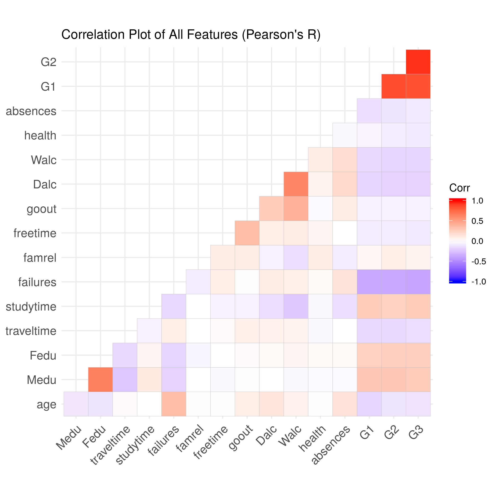
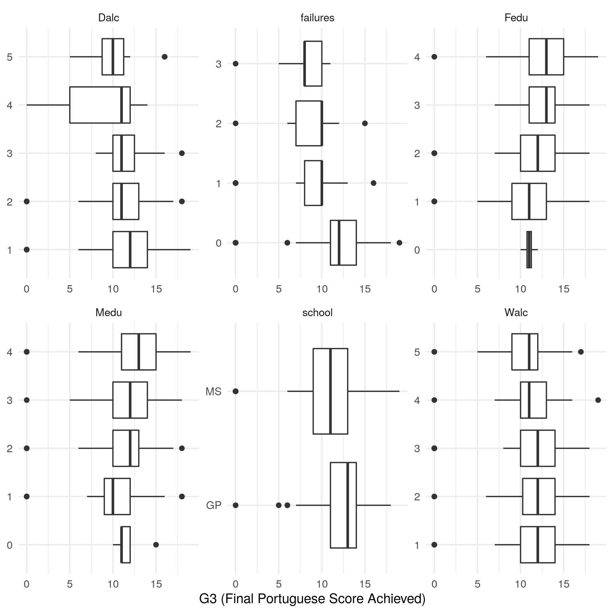
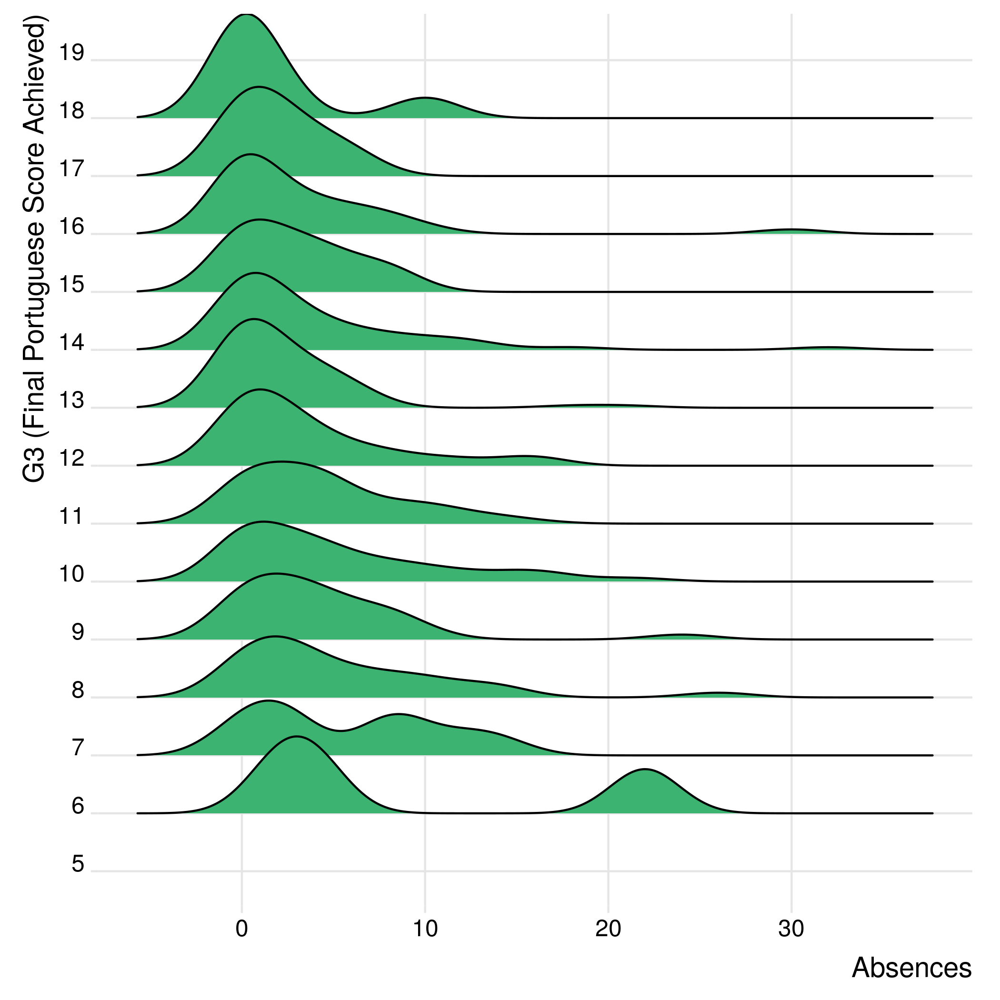
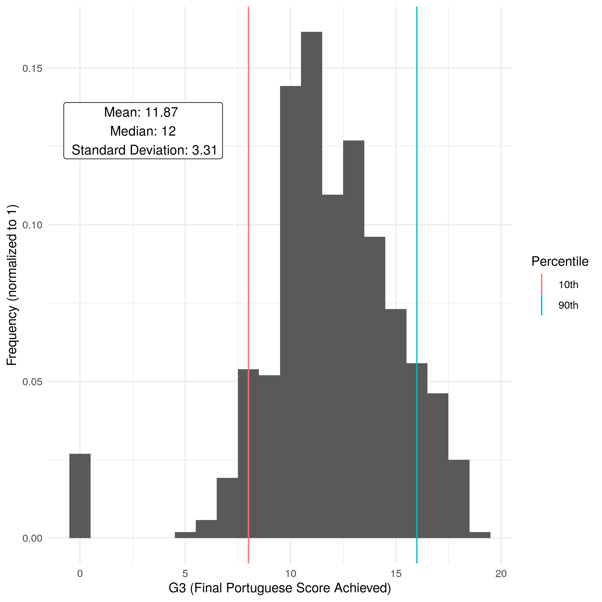
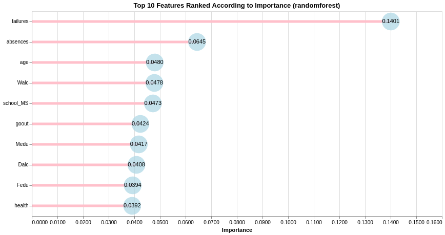

# DSCI522 Group 403 - Student Performance Predictors Report

Investigating the predictors of Portuguese high school student
performance

This project is proudly brought to you by:

  - [Brayden Tang](https://github.com/braydentang1)
  - [Kenneth Foo](https://github.com/kfoofw)
  - [Brendon Campbell](https://github.com/brendoncampbell)

## Motivation & Data Set

In developing social initiatives to improve student scores, it could be
immensely useful to understand what attributes play a strong role in
predicting predicting student performances on various subjects. Without
identifying these key factors, such initiatives would likely be less
effective and would fail to provide a high return on the school board or
government’s investment.

Our selected data set summarizes Portuguese high school student’s
academic performance in both Math and Portuguese. For this project we
are trying to answer the question: **what are the top five features that
most strongly predict high school student’s performances in their
Portuguese language course?**

The data set was sourced from the [UCI Machine Learning
Repository](https://archive.ics.uci.edu/ml/datasets/Student+Performance)
(Cortez 2014), which was part of an [original research
paper](http://www3.dsi.uminho.pt/pcortez/student.pdf) (Cortez and Silva
2008). The data was compiled from official school reports as well as
questionnaires provided to students. Attributes of the datasets include
the student grades, demographic, social and other school related
features. Two datasets are provided regarding the performance in two
distinct subjects: Mathematics (`mat`) and Portuguese language (`por`),
though these datasets do not correspond to the same students.

For the scope of this analysis, we are focusing only on the
**Portuguese** data set to investigate which student attributes are the
strongest predictors of performance in that subject.

Some key highlights regarding the data set’s attributes:

  - The feature of interest is `G3` which represents the final subject
    grade score at the end of the academic year. The score ranges from 0
    to 20.
  - Multi-categorical attributes such as family size (`famsize`),
    parent’s education (`Fedu`/`Medu`) or weekly study time
    (`studytime`)
  - Binary attributes such as home internet access (`internet`) or
    family educational support (`famsup`)
  - Count attributes such as number of days of absence (`absences`)

For complete descriptions of each of the features, see the [UCI Machine
Learning Repository
page](https://archive.ics.uci.edu/ml/datasets/Student+Performance)
(Cortez 2014) or refer to the `student.txt` file that accompanied the
raw data files [here](../data/raw/student.txt).

## Exploratory Data Analysis

Before building our model, we partitioned the data into a training and
test set (split 80%:20%) and performed exploratory data analysis (EDA)
to investigate the distribution of our predictive features. The EDA was
initiated by determining if there are any highly correlated features
that we might want to omit from our
analysis.

### Feature Correlations:

**Figure 1 - Feature Correlations**

As seen from Figure 1, our target attribute `G3` has a strong
correlation with attributes `G2` and `G1`. This occurs because `G3` is
the grade issued at the end of the year, while `G1` and `G2` correspond
to the grades for the 1st and 2nd school terms of that year. We are more
interested in which attributes, other than recent academic performance,
that will be most predictive of academic performance. Though it will be
more difficult to get accurate predictions without these features,
**both `G1` and `G2` features will be omitted** in light of our research
question and motivations outlined above.

### Variable Distributions:

 **Figure 2 - Distribution
Boxplots for Categorical & Binary Features**

Looking at the feature distribution boxplots in Figure 2, we can see
that some of the most noteworthy features include student’s past number
of course failures (`failures`), parental education levels (`Medu`,
`Fedu`), alcohol consumption on weekdays and the weekend (`Dalc`,
`Walc`), and the school they attended (`school`). Each of these appears
to show a clear trend with respect to G3, so we would expect some of
these features having strong predictive power in the machine learning
models we
develop.

**Figure 3 - Ridgeplot of Absences Feature**

Similarly, Figure 3 shows that lower `G3` scores have longer tails of
`absences` counts, indicating this may be a useful predictive feature as
well.

**Figure 4 - Distribution of Response Variable, G3**

Finally, our response variable G3 shows an approximately normal
distribution, with a mean of 11.87 and a median of 12 out of 20. There
are some outliers at the low end (students with a score of 0), which
ends up pulling down the mean value slightly.

## Predictive Modelling

To answer the predictive question posed above, we built and compared
several predictive regression models. We constructed the following
models, optimizing each according to the specified hyperparameters.
Model performance was evaluated using root mean squared error (RMSE).

A total of 5 models were chosen using Scikit Learn (Buitinck et al.
2013), XGBoost (Chen and Guestrin 2016), and Light GBM (Ke et al. 2017):

  - Linear Regression with Lasso (L1)  
  - Linear Regression with Ridge (L2)  
  - Random Forest
  - XGBoost Regressor  
  - LightGBM Regressor

The choice for model types stem from the feature extraction
functionalities that they provide, which is needed for our research
question of finding the top predictive features. Linear regression
models can output the weights of each feature, while tree models can
output the feature importances according to the node splitting.

We applied the following preprocessing techniques for the data:

  - Standard Scaling for numerical features
  - One-Hot-Encoding for binary/categorical features.

Hyperparameters were tuned with the Bayesian Optimization package
(Nogueira 2017) using 10 fold cross validation. For more details on the
best hyperparameters for each model, please find the stored outputs in
the [data outputs folder](../data/outputs/). The validation results for
each tuned model type are shown in the following:

|    Model     | cv\_rmse\_score |
| :----------: | :-------------: |
| randomforest |      2.651      |
|     xgb      |      2.704      |
|  lm\_ridge   |      2.735      |
|  lm\_lasso   |      2.741      |
|     lgbm     |      2.727      |

Using the preprocessed test data, we scored all five tuned models. The
test results for each tuned model type are as shown below:

|    Model     | test\_rmse\_score |
| :----------: | :---------------: |
| randomforest |       2.417       |
|     xgb      |       2.453       |
|  lm\_ridge   |       2.481       |
|  lm\_lasso   |       2.484       |
|     lgbm     |       2.578       |

Based on the results, the RandomForest model performed best with a RMSE
of 2.417.

## Ranked Features & Conclusions

The top 10 ranked features from our Random Forest regression model were
as follows:

**Figure 5 - Ranked Features for Random Forest Model**

For the most part, the results appear to be inline with our expectations
based on the features identified during the EDA process. `failures` and
`absences` are the clear leaders, while many of the other highly
important features were noted during EDA. Figure 5 includes the top 10
features to illustrate that the subsequent 5 most important features
follow closely in terms of their importance scores.

To formally address our research question, the five most predictive
features are:

1.  failures (number of past class failures)
2.  absences (number of school absences)
3.  age (student’s age)
4.  Walc (weekend alcohol consumption)
5.  school (student’s school)

Given that we have identified attributes that are strongly predictive of
academic performance, this information could now be used to develop
social programs or initiatives intending to improve student’s academic
performance. Targeting these specific attributes is likely to improve
the effectiveness of such programs and thereby provide better return on
investment.

## Reflections & Next Steps

**Dropped features:**

We dropped features `G1` and `G2` after our EDA with the intent of
removing features based on recent academic performance. `Failures`,
which ended up being our top predictor, is highly correlated with `G1`
and `G2` and could perhaps be removed in subsequent analysis attempting
to focus on non-academic predictive attributes.

**Math data set:**

For this analysis, we focused on only one of two available student
performance data sets. We looked at student performance in Portuguese,
rather than Math. In the future it would be interesting to explore
whether the same model features are strong predictors across both
subjects, or whether different subjects are predicted better by
different features. We would be curious to see if performance in Math is
strongly predicted by the ‘going out with friends’ attribute, for
example.

**Modelling assumptions:**

In our analysis, we assumed the target `G3` as a fully continuous
variable and treated the overall problem as a regression. However, this
is not actually true. Indeed, the variable can only take on discrete
values from 0-20 and values such as 1.115 or 19.333 are not possible.

One might then think to switch to rephrasing this problem as a
multi-class classification instead. However, there is a clear ordering
in the target variable and in particular, the distance between the
predicted score G3 and the actual score is important. For example,
suppose we have a student who is known to have a `G3` score of 20 and
two candidate classifiers. One classifier predicts a G3 score of 5, and
another predicts a G3 score of 19. In classification, both of these
errors are treated equally even though the second classifier is much
closer to the truth than the first.

In summary, our problem is neither regression or classification. Our
problem instead is that of ordinal regression, which can be viewed as a
middle ground between the two. We wish to predict discrete labels while
still respecting the relative nature of the labels themselves. Thus, a
huge improvement to our analysis would be to switch to a better
framework more suited for such a response.

**Feature Engineering:**

There were a number of features that could possibly have been
represented in a more informative way. In particular, there were quite a
few ordinal features (such as `Dalc`, `Walc`, and `famrel`) that were
represented as numeric features ranging from 1 to 5. This was done to
preserve the natural ordering of the features, but it is not necessarily
true that each of the levels should be evenly spaced between them. It
could be the case that the jump from level 1 to level 2, for example, is
much larger than the jump between level 4 and 5.

A possible avenue to explore could be to make use of [polynomial
contrasts](https://en.wikipedia.org/wiki/Contrast_\(statistics\)#Sets_of_contrast)
to account for this possibility.

**Using Variable Importance Scores:**

There are some problems associated with using variable importance scores
to assess predictive performance, especially when features are
collinear. Features that carry large amounts of the same information
tend to get their importance scores “shared” between them. Intuitively,
features that are nearly identical in information can be randomly chosen
between them without any loss in model performance. The practical
consequence of this is that some of the features have scores that are
potentially much lower than they should be.

Variable importance scores can be corrected for this phenomenon and this
may be worth exploring in the future.

# References

Buitinck, Lars, Gilles Louppe, Mathieu Blondel, Fabian Pedregosa,
Andreas Mueller, Olivier Grisel, Vlad Niculae, et al. 2013. “API Design
for Machine Learning Software: Experiences from the Scikit-Learn
Project.” In *ECML Pkdd Workshop: Languages for Data Mining and Machine
Learning*, 108–22.

Chen, Tianqi, and Carlos Guestrin. 2016. “XGBoost: A Scalable Tree
Boosting System.” In *Proceedings of the 22nd Acm Sigkdd International
Conference on Knowledge Discovery and Data Mining*, 785–94. KDD ’16. New
York, NY, USA: ACM. <https://doi.org/10.1145/2939672.2939785>.

Cortez, Paulo. 2014. “UCI Machine Learning Repository.” University of
California, Irvine, School of Information; Computer Sciences.
<http://archive.ics.uci.edu/ml>.

Cortez, P., and A. Silva. 2008. “Using Data Mining to Predict Secondary
School Student Performance.” In *Proceedings of 5th Future Business
Technology Conference*, edited by A. Brito and J. Teixeira, 1905:5–12.
FUBUTEC. <https://doi.org/978-9077381-39-7>.

Ke, Guolin, Qi Meng, Thomas Finley, Taifeng Wang, Wei Chen, Weidong Ma,
Qiwei Ye, and Tie-Yan Liu. 2017. “LightGBM: A Highly Efficient Gradient
Boosting Decision Tree.” In *NIPS*.

Nogueira, Fernando. 2017. *Bayesian Optimization: Pure Python
Implementation of Bayesian Global Optimization with Gaussian Processes.*
<https://github.com/fmfn/BayesianOptimization>.

